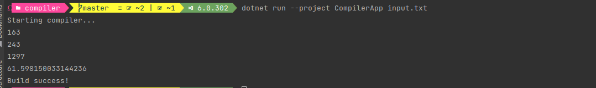
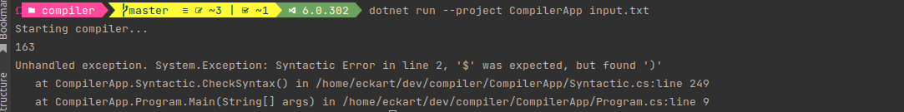

# Simple calculator compiler 
Project related to the final work of the Compilers discipline.

To run the program use ```dotnet run --project CompilerApp``` or ```dotnet run --project CompilerApp {fileName}```.

### Output on successful compilation



### Output in case of compilation failure



 ### Lexical State Machine
 


 ### Table M
 


